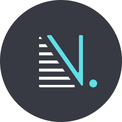

# Simple Notes Beaver

<p align="center">

</p>

Simple Notes Beaver is the backend project of the Simply Note. Nest.js is used to build this project. [Simple Notes Falcon](https://github.com/Deepak-Kharah/simple-notes-falcon) uses this project to get the data to display to the user.

This project serves as an instrument to learn backend techniques used in the production environment. Hence, the Simple Notes beaver supports only the CRUD operation.

# Get started

- Install the dependencies

  Run the following command in the terminal at current directory.

  ```sh
  npm install
  ```

- Set up a MongoDB server

  Use mongoDB atlas to create a new server and note the credentials for next step

- Set up environment variables

  Create a new file at the root of the project, named `.env.development` and copy the content of `.env.example`. Now, replace the pseudo configuration with actual details.

- (optional) Tweak the configurations

  There are some configurations present at `config/configuration.ts`, these configuration could be updated as needed.

- Run the project
  For development, run the following command to run the project in watch mode.
  ```sh
  npm run start:dev
  ```

# Principle

There are no such accentuated principles to follow. Still, I made some proactive decisions during the entire process. Hence, you could find some design decisions like reserving usernames like **me**, **admin** and **anonymous**.

# The Future

I might experiment with new techniques that will enhance this project. Some enhancements are logging support, test suites and more CI/CD workflow to the project. But, there is no defined outline as of now.

# License

Copyright 2022 Deepak Kharah

Permission is hereby granted, free of charge, to any person obtaining a copy of this software and associated documentation files (the "Software"), to deal in the Software without restriction, including without limitation the rights to use, copy, modify, merge, publish, distribute, sublicense, and/or sell copies of the Software, and to permit persons to whom the Software is furnished to do so, subject to the following conditions:

The above copyright notice and this permission notice shall be included in all copies or substantial portions of the Software.

THE SOFTWARE IS PROVIDED "AS IS", WITHOUT WARRANTY OF ANY KIND, EXPRESS OR IMPLIED, INCLUDING BUT NOT LIMITED TO THE WARRANTIES OF MERCHANTABILITY, FITNESS FOR A PARTICULAR PURPOSE AND NONINFRINGEMENT. IN NO EVENT SHALL THE AUTHORS OR COPYRIGHT HOLDERS BE LIABLE FOR ANY CLAIM, DAMAGES OR OTHER LIABILITY, WHETHER IN AN ACTION OF CONTRACT, TORT OR OTHERWISE, ARISING FROM, OUT OF OR IN CONNECTION WITH THE SOFTWARE OR THE USE OR OTHER DEALINGS IN THE SOFTWARE.
